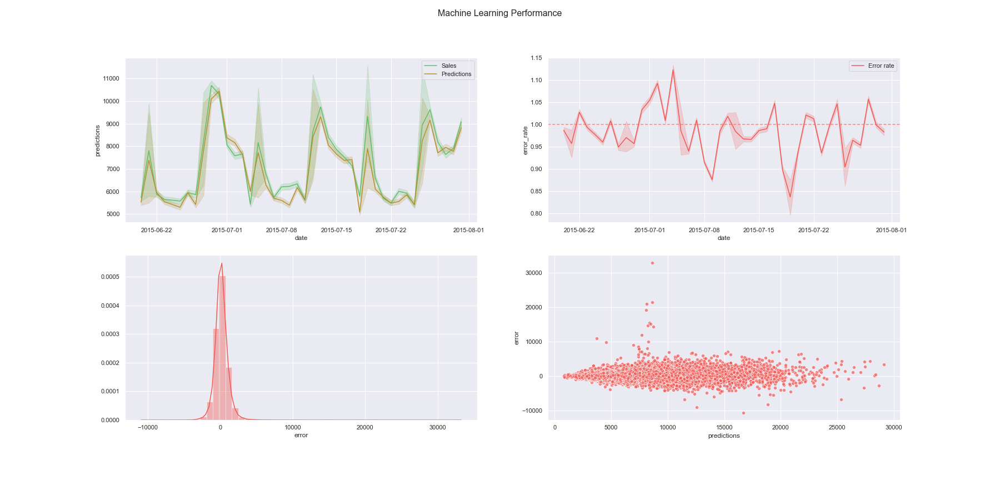

# <b>Rossmann Sales Forecast</b>

# 1. Business Problem
Rossmann is a European company who operates over 3000 drug store in 7 countries. The CFO and sales team had a huge difficult to predict how much your stores was selling and how much it could sell in next weeks and there's no automated process to obtain this information. In order to create a better financial planning with a low margin of error, they asked for the data team to create a solution to this problem and one that any employee can see the results anywhere.

# 2. Dataset
The dataset is available on https://www.kaggle.com/c/rossmann-store-sales/data.

# 3. Solution Strategy

My strategy to solve this challenge was test machine learning models to forecast sales for the next 6 weeks and decide which will bring the best result for the company.
After the modelling, the delivered solution was a telegram bot that receives the store number and returns the forescast for the next weeks.

**Step 01. Data Description:**  Use descriptive statistics metrics to measure data distribution

**Step 02. Feature Engineering:** Create features to describe the fenomenous.

**Step 03. Data Filtering:**  Filter the features values to make ML modelling easier.

**Step 04. Exploratory Data Analysis:** Find insights to better describe the fenomenous and brake wrong concepts.

**Step 05. Data Preparation:**  Prepare the data to the step 7.

**Step 06. Feature Selection:** Select the most important features to the problem.

**Step 07. Machine Learning Modelling:** Machine Learning model selection and training.

**Step 08. Hyperparameter Fine Tunning:** Find the best values of each parameter of the model.

**Step 09. Convert Model Performance to Business Values:** Convert the machine learning performance into business result.

**Step 10. Deploy Model to Production:**  Develop a deliver solution. 

# 4. Mind Map Hypothesis

# 5. Top 3 Data Insights

**Insight 01:** Stores with closer competitors sell more.

**Insight 02:** Sales grow more to smaller assortment, public Holidays and store types "A" and "D".

 
 
**Insight 03:** Stores sell less in the second half of the year.

 

# 6. Machine Learning Model Applied
The tested models are:
- Avarage mean as a baseline
- Linear Regression
- Lasso Regression
- Random Forest Regressor
- XGBoost Regressor

The best model in this case was the XGBoost Regressor.

# 7. Machine Learning Model Performance

| Plot  |  Translation  |
| ------------------- | ------------------- |
| Sales and prediction Lineplot |  The predictions of our model is close to the real value for sales |
|  Error Lineplot |  The error rate has low variance |
|  Distplot |  The error distribution is similar to a normal distribution, that's good |
|  Scatterplot |  There are some stores with higher error in the points that seems like a horizontal tube, this means that there are a variation rate in the error |

# 8. Business Results
Considering the error rate, the best and worst scenarions was calculed with the prediction. The solution brings a good performance and gives a lot of information to the CEO to direct investmests.

| Scenario  |  Values  |
| ------------------- | ------------------- |
| Prediction |  $274,491,136.00 |
|  Worst Scenario |  $273,749,324.67 |
|  Best Scenario |  $275,232,945.67 |

# 9. Conclusions
With the result of the forecasts and knowing the error rate, the CFO's investment decision has become simpler, in addition to that, anyone within the company can consult the results of the forecasts with the telegram bot anywhere, enabling a better and faster decision making.

# 10. Lessons Learned
- It’s always a good idea to do an EDA before applying machine learning to gain insights and learn how the business works.
- As accurate as your model is, it will be useless if it does not translate it to a business solution and cannot be used by employees on a daily basis.

# Next Steps to Improve
- Experiment other Machine Learning Algorithms.
- Select other features to see how much the RMSE change.
- Improve telegram bot to better user interactions.
- Create mind maps before starting the project itself helps a lot in deciding where to focus.

# Who am I?

My name is Gutto França, I'm a Data Scientist in formation since 2020.

* 
* 
